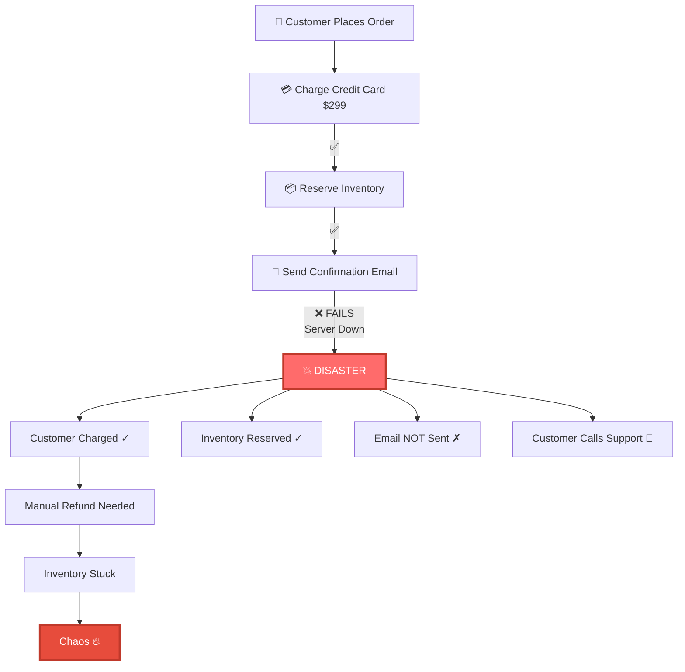
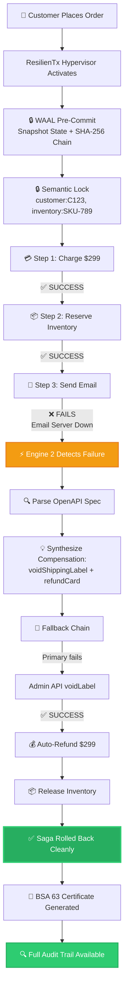
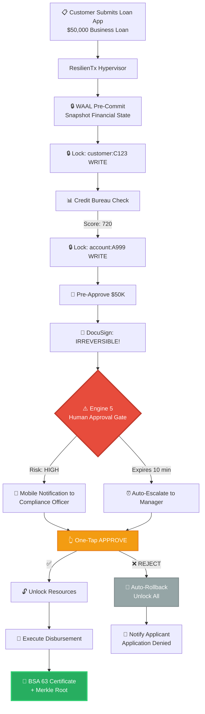
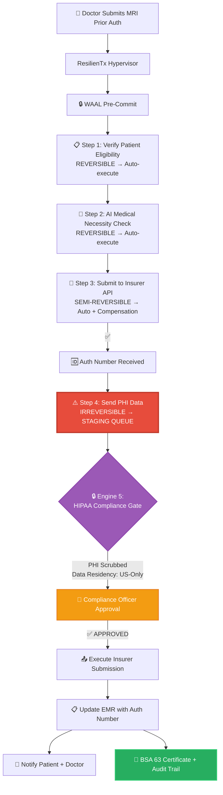
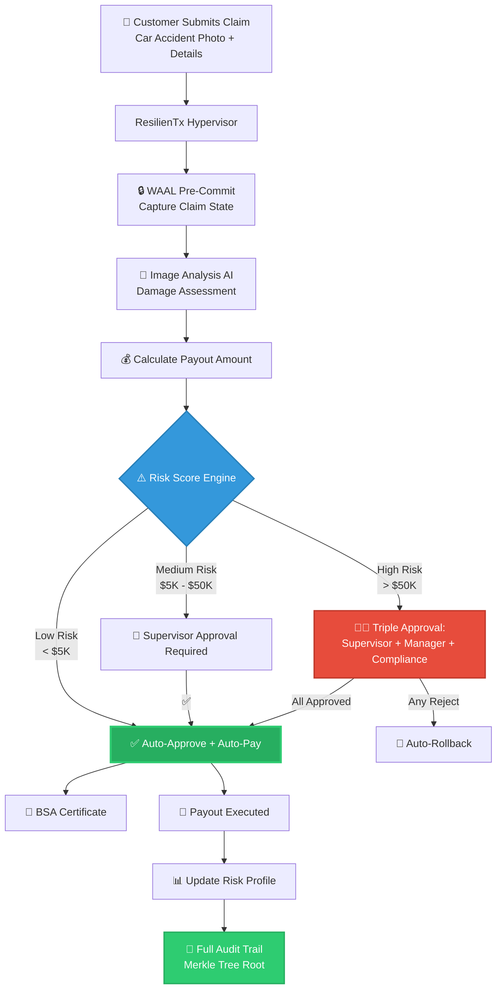
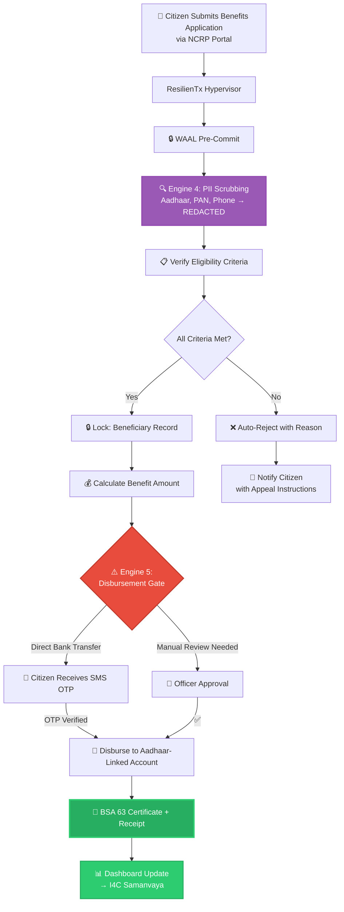
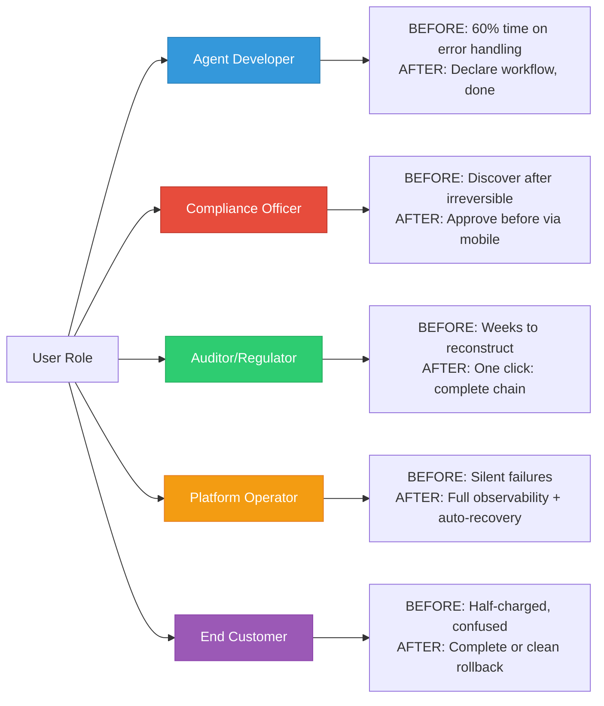

# ResilienTx Solution — User Friendly Flowcharts & Examples

> **Purpose**: Visual, copy-paste friendly reference showing exactly how ResilienTx works across real industries.
> **Each flowchart uses Mermaid syntax** — works in VS Code, GitHub, Notion, Obsidian.

---

## 🎯 Example 1: E-Commerce Order Processing (Customer Journey)

### Without ResilienTx (Disaster)



### With ResilienTx (Clean Recovery)



**User Feel**: _"Customer charged $0, inventory restored, zero support calls, full audit trail — all automated."_

---

## 🎯 Example 2: Loan Approval Workflow (Banking/Finance)



**User Feel**: _"Compliance officer gets a mobile notification, approves with one tap, funds disbursed with full legal evidence — all in under 10 minutes."_

---

## 🎯 Example 3: Healthcare Prior Authorization



**User Feel**: _"PHI never touches disk raw. Compliance officer approves PHI transfer. Patient gets notified instantly. Full HIPAA audit trail generated automatically."_

---

## 🎯 Example 4: Insurance Claim Processing



**User Feel**: _"Small claims auto-approved in seconds. Big claims get human review. Every payout has full evidence trail. Fraud detected automatically."_

---

## 🎯 Example 5: Government Benefits Processing



**User Feel**: _"Citizen applies online, PII automatically scrubbed, benefit disbursed to bank account with receipt, government has full audit trail for compliance."_

---

## 🏭 Industry Summary Matrix

```mermaid
flowchart LR
    A[ResilienTx Industries] --> B[Financial Services]
    A --> C[Healthcare]
    A --> D[Insurance]
    A --> E[E-Commerce]
    A --> F[Government]
    A --> G[Telecom]
    A --> H[Legal/Compliance]
    A --> I[Energy/Utilities]

    B --> B1[Loan origination<br>Trade settlement<br>AML/KYC]
    C --> C1[Prior auth<br>Claims<br>Patient onboarding]
    D --> D1[Claim adjudication<br>Policy issuance<br>Reinsurance]
    E --> E1[Order-to-cash<br>Returns<br>Loyalty]
    F --> F1[Benefits<br>Permits<br>Tax filing]
    G --> G1[Service provisioning<br>Number porting<br>Billing]
    H --> H1[Contract lifecycle<br>Regulatory filing<br>e-discovery]
    I --> I1[Meter-to-cash<br>Outage mgmt<br>Grid operations]

    style A fill:#2c3e50,stroke:#34495e,stroke-width:3px,color:#fff
    style B fill:#3498db,stroke:#2980b9
    style C fill:#2ecc71,stroke:#27ae60
    style D fill:#e74c3c,stroke:#c0392b
    style E fill:#f39c12,stroke:#e67e22
    style F fill:#9b59b6,stroke:#8e44ad
    style G fill:#1abc9c,stroke:#16a085
    style H fill:#d35400,stroke:#c0392b
    style I fill:#34495e,stroke:#2c3e50
```



---

## 👤 User Perspective Comparison



---

## 🔑 One-Line Mental Model

> **ResilienTx = PostgreSQL ACID + Git immutable history + Human approval gates + Legal evidence generation — but for distributed AI agent workflows across ANY APIs.**

```
┌─────────────────────────────────────────────────────────────────────────┐
│                                                                         │
│   EVERY AI AGENT ACTION NOW HAS:                                        │
│   ✅ ACID guarantees         ← Like a database transaction              │
│   ✅ Immutable audit trail   ← Like Git commit history                  │
│   ✅ Human approval gates    ← Like a legal signature                   │
│   ✅ Court-admissible receipt ← Like a notarized document                │
│   ✅ Auto-compensation       ← Like an undo button for distributed APIs │
│   ✅ PII protection          ← Like a privacy vault                     │
│                                                                         │
└─────────────────────────────────────────────────────────────────────────┘
```

---

> **To view these flowcharts**: Copy any Mermaid block into [mermaid.live](https://mermaid.live) or paste into VS Code with Mermaid extension enabled.
